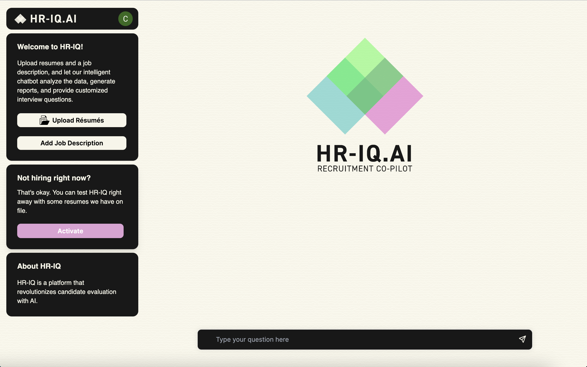
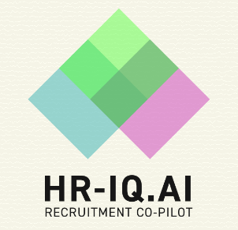

# HR-IQ



## What is HR-IQ?

HR-IQ is a platform that revolutionizes candidate evaluation with AI. The inspiration behind HR-IQ was to create a centralized space to efficiently assess potential job candidates. We aim to speed up the timely process of collecting candidate information, screening, and evaluating candidates for specific roles. HR-IQ is an unbiased evaluator that will present top candidates to you.

## Dev Instructions

**1. Clone Repo**

```bash
git clone https://github.com/toddbomb/hr-iq.git
```
**2. Running Frontend**
```bash
cd frontend
npm i
npm run dev
```
**3. Running Backend**
```bash
cd backend
pip install -r requirements.txt
flask run
```
**2. Configuring an OpenAI API key**
  
Create a .env.local file in the frontend folder
```bash
OPENAI_API_KEY=YOUR_KEY
```
Create a .env file in the backend folder
```bash
export OPENAI_API_KEY=YOUR_KEY
```
If you don't have an OpenAI API key, you can get one [here](https://platform.openai.com/account/api-keys).

## What's next

We're excited about the future of HRIQ and we have so many ideas about what we'd like to build out. Just to name a few...

- [ ] Connect to handshake and other hiring platforms
- [ ] Generating automated candidate reports that get sent out weekly
- [ ] Automating emails to qualified first and second round candidates
- [ ] Connecting candidate GitHub to perform code quality analysis
- [ ] Connecting to audio tools such as fireflies.ai to analyze audio interviews

## Contact 

Tushar Aggarwal, Cristin Connerney, Hongyi Wu, Iris Cheng, and Alex Kim created this AI app as a submission for [pinecone](https://devpost.com/software/hriq)'s hackathon. If you have any questions or comments, please reach out to [Tushar Aggarwal](tusharagg12@gmail.com).




